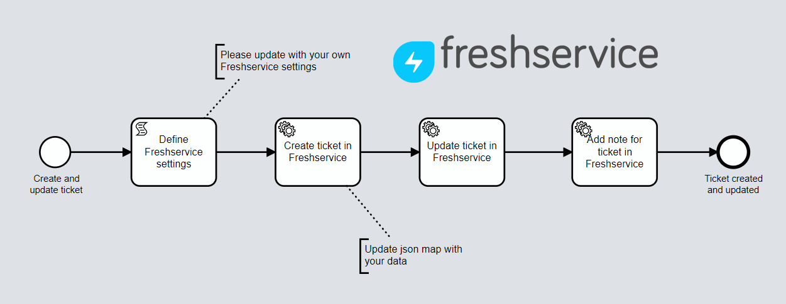

# Onify Blueprint: Create and update ticket in Freshservice

[Freshservice](https://freshservice.com/) is a modern ITSM tool from [Freshworks](https://www.freshworks.com/). This Blueprint shows how to create and update a ticket in Freshservice via REST API.

## Requirements

* Onify Hub  
* Camunda Modeler
* Freshservice 

## Included

* 1 x Flows

## Setup

### Deploy

1. Open flow/bpmn in Camunda Modeler
2. Change settings/vars the the `Define Freshservice settings` task
3. Click `Deploy current diagram` and follow the steps

### Run 

To test and run the flow, click `Start Current Diagram`

## Support

* Community/forum: https://support.onify.co/discuss
* Documentation: https://support.onify.co/docs
* Support and SLA: https://support.onify.co/docs/get-support

## License

This project is licensed under the MIT License - see the [LICENSE](LICENSE) file for details.

## Thanks

Thanks [Academic Work](https://github.com/orgs/academicwork) and [Mattias Frykstrand](https://github.com/Mfryk85) for assisting us with a Freshservice sandbox environment!